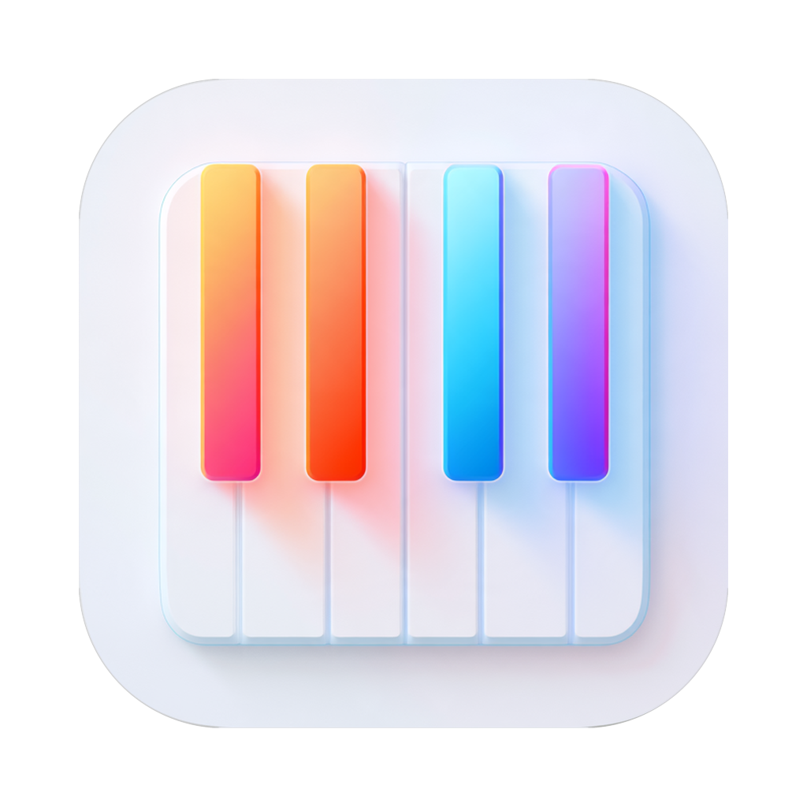
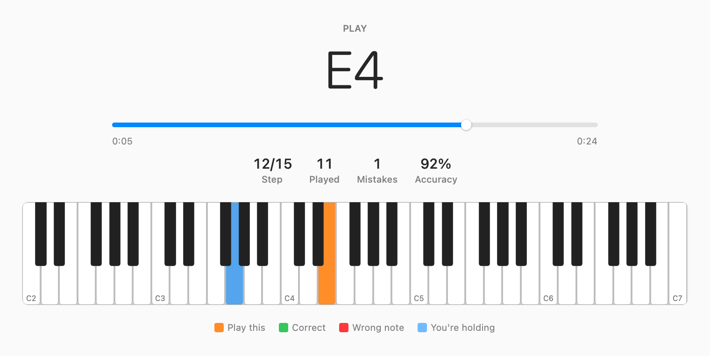
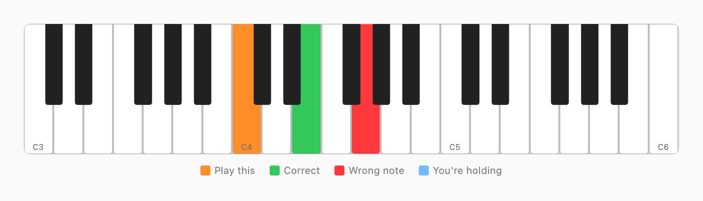

<div align="center">



# TheONE Light Practice

**Play and learn any song on TheONE Light piano.**

Reverse-engineered USB commands for TheONE Light Piano allowing you to learn and play any song with the light-up keys!

</div>

---



## What it does

Drop in a song and your keyboard lights up the key to play. It waits for you to
play it, then lights up the next one. Learn and play at any speed.

- **Practice** — one note at a time
- **Listen** — hear and watch the song played for you
- **One hand at a time** — learn the right hand, then the left, then both
- **Jump anywhere** — drag the progress bar to practise any portion of a song

## What you need

- A **THE ONE Light** keyboard, plugged in with a USB cable (USB 3.0)
- A **Mac** running macOS 14 or later, or an **iPad or iPhone** running iOS 17 or
  later
- Some songs — any `.mid` file works. Running `python3 Scripts/make-easy-song.py`
  writes three easy ones into `Samples/` to get started.

## Getting started

**On a Mac**

```
brew tap Shmoopi/theone-light-practice https://github.com/Shmoopi/TheONE-Light-Practice
brew install --cask theone-light-practice
```

Or download the latest release, drag it to your Applications folder, and open it.

**On an iPad or iPhone**

Build it yourself with Xcode — there's no App Store build.
[docs/IPHONE-AND-IPAD.md](docs/IPHONE-AND-IPAD.md) walks through it, including
which cable or adapter you need.

**Then**

1. Plug in your keyboard and turn it on. The app finds it by itself.
2. Drag a song onto the list on the left, or use the Import button.
3. Press **Start**, and play the key that lights up.

That's it. Your progress, mistakes and accuracy show as you go.

## The colors on screen



The keyboard in the app follows and lights up as you go along:

| | |
|---|---|
| 🟠 **Orange** | Play this one |
| 🟢 **Green** | You got it |
| 🔴 **Red** | Wrong note — it'll keep waiting |
| 🔵 **Blue** | A key you're holding down |

## Settings worth knowing

**Both hands / Right hand / Left hand** — Most people learn one hand first. Pick a
hand and the other one is left out (best effort).

**Hold chords together** — Off by default. Turn it on and a chord only counts when
every note is down at once, which is how you'd really play it. The whole chord
stays lit until you have it.

**Fit to keyboard** — On by default. Most piano music is written for a full-size
88-key piano, TheONE Light has 61 keys. This shifts the notes that don't fit onto
ones that do, instead of skipping them. The app tells you when it's had to do
this, because those notes will sound a little different.

**Speed** — In Listen mode, slow the song right down to hear how a passage goes.

## Questions

**It says it can't find my keyboard.**
Check the USB cable is in and the keyboard is switched on, then quit and reopen the
app. The app lists what it finds, which usually points at the problem.

**Nothing lights up.**
If the official app is open, close it — only one program can drive the keyboard lights at a
time.

**Some notes are missing.**
The song may go higher or lower than 61 keys. Turn on **Fit to
keyboard** and they'll be moved into range.

**It says my hands might be wrong.**
Some song files say which hand plays what, and some don't. When a file doesn't say,
the app guesses by splitting at middle C — which is wrong wherever your hands cross
over.

**Where are my songs kept?**
On a Mac, in `~/Library/Application Support/TheONE Light Practice/Songs`. On an
iPad or iPhone, in the app's own folder in the **Files** app — you can drop `.mid`
files straight in there. Songs are copied in when you add them, so moving or
deleting the original .mid files shouldn't break anything.

## Making your own practice songs

`Scripts/make-easy-song.py` writes a few simple, out-of-copyright tunes into
`Samples/` — Beethoven's Ode to Joy, Twinkle Twinkle, and Frère Jacques:

```
python3 Scripts/make-easy-song.py           # all of them
python3 Scripts/make-easy-song.py twinkle   # just one
```

It needs nothing but Python itself. These are generated rather than kept in the
repository.

Any MIDI file works, though. If the file labels its parts "Left Hand" and "Right
Hand", the app will use those labels.

## Building it yourself

```
swift build                          # build
python3 Scripts/make-easy-song.py    # write the sample songs the tests read
swift test                           # run the tests
Scripts/bundle.sh                    # make the Mac app
```

For iPhone and iPad, open `TheOnePractice.xcodeproj` — it builds the same sources
in `Sources/TheOnePractice`. There's one copy of the code and no project file
to keep in step. See [docs/IPHONE-AND-IPAD.md](docs/IPHONE-AND-IPAD.md).

`docs/PROTOCOL.md` explains how the app talks to the keyboard.

## YMMV

This is a personal project. This is not a product from the people who make the keyboard.
It talks to hardware you own, over the standard MIDI connection. It doesn't touch your account, the official app, or anything you've bought. This is in no way affiliated with the manufacturer. No warranty or guarantees are made about this project or any of the code within. It could break your device and/or void your device warranty. Your mileage may vary. Use at your own discretion.

## License

MIT licensed — see `LICENSE`.
